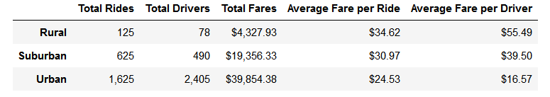

# PyBer Ridesharing Analysis

## Overview
<!-- create summary DF comparing data by city type, then week by week line-plot showing fare for each city type -->
In this project, we analyzed ride-sharing data based on the city type - urban, suburban, or rural - in which the trip took place.  We compared the number of drivers, the average fare, the total fare, and the number of rides for each category, then examined the total fares per week collected by each group.  

## Results
### Summary Statistics

Our full summary is displayed above.  We found that urban cities have almost 5 times the number of drivers as suburban cities, and over 30 times as many drivers as rural cities, with urban cities accounting for just over 80% of drivers[^driver_pie].  Urban cities also account for about 68% of rides[^rides_pie], with 1,625 of the 2,375 total rides in [our sample](Resources/ride_data.csv).  While urban cities contribute the greatest total fare and number of rides, rural cities have the greatest average fare per trip and average fare per driver.  While average fare per trip only has a range of $10.09, the average fare per driver has a range of $38.92, from urban cities' average of $16.57 to rural cities' average of $55.49.   

### Weekly Fares

The chart above shows the total weekly fares for urban, suburban, and rural cities from January through the end of April.  Looking this way, it's clear to see that urban cities consistently collected the most in fares, and rural cities collected the least.  The lines never intersect with each other, each maintaining a unique range. This tells us little we didn't already know from the summary statistics on a large scale, but on a weekly scale we can see a local maxima around the last week of February for all categories.  It may be interesting to investigate if there was an event of any sort that would cause that increase in traffic, though it's minor enough that it could simply be a coincidence.

## Summary
<!-- rural cities could use more drivers, potentially lowering fares and increasing use - would depend on distance and time for rides, to see if lower fares are feasible.
Conversely, urban cities could possibly do with fewer drivers, so that each driver earns more.  There were more drivers than rides in our dataset, which seems weird 
Are we double counting any drivers?  I wouldn't be surprised if a driver was willing to cover several cities near each other.
-->
Total fare and average fares per ride seem reasonably consistent, given the number of riders and their respective city types.  From my personal experiences, rural trips often cover a greater distance than urban trips, but it would be interesting to have empirical data to check that theory against.  The disparities come in when we look at average fare per driver, with rural cities averaging over 3 times that of urban cities.  Focusing our attention on hiring more rural drivers could help balance that.  Additionally, having more rural drivers may increase the number of riders in those areas, by making rides more available.  Conversely, lowering the number of urban drivers would also be beneficial.  In 2019, there were nearly 1.5 times as many drivers as there were rides in urban cities, which indicates an overabundance of drivers.  This leads me to wonder if we have double counted any drivers; it wouldn't surprise me if some drivers were willing to work in several cities that are near enough to each other, and we didn't count individual drivers but rather summed the number of drivers registered to each city.  

[^driver_pie]: This percentage was calculated in a previous project, the code for which can be found under [PyBer.ipynb](PyBer.ipynb), with results displayed in [Fig7.png](analysis/Fig7.png).
[^rides_pie]: This percentage was calculated in [PyBer.ipynb](PyBer.ipynb), with results displayed in [Fig6.png](analysis/Fig6.png).
