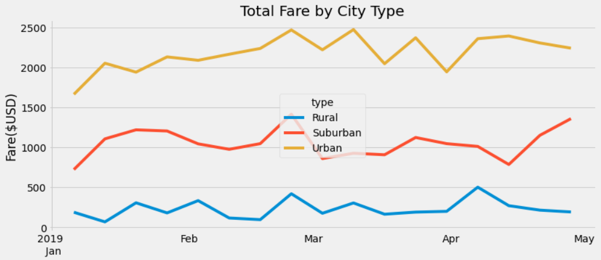

# PyBer Ridesharing Analysis

## Overview
<!-- create summary DF comparing data by city type, then week by week line-plot showing fare for each city type -->

## Results
### Summary Statistics

### Weekly Fares

## Analysis
